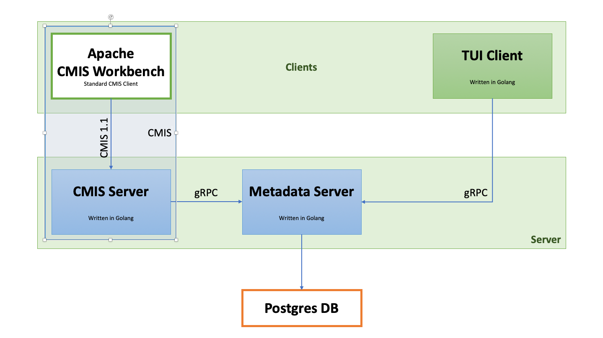
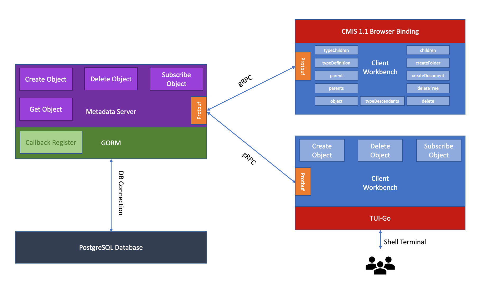
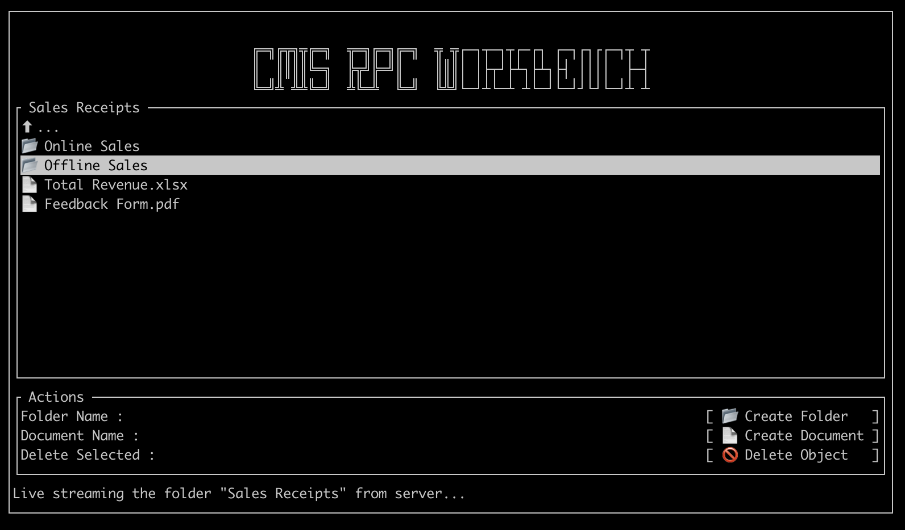
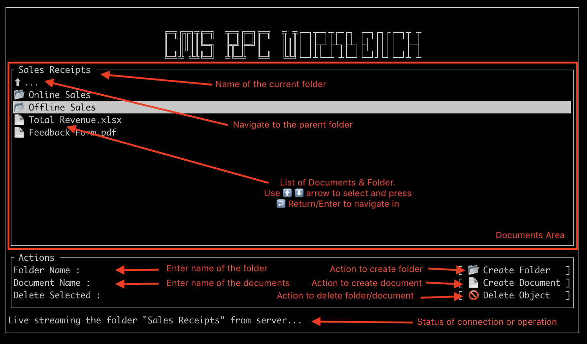

# A Documents Server & Workbench Client

A small implementation of a **CMIS server**, gRPC based **Metadata Server** and a gRPC based **TUI Client** allowing creating/deleting folders/documents in the server. All 3 components are written in Golang. The metadata is persisted in Postgre DB. The server-client interface is either through `gRPC` which is a *Remote-Procedure-Call* protocol or via `CMIS` through *CMIS Workbench*.

## Overview



This repository contains a PoC project and is a proposal for Document-Management ecosystem. It has 3 components

1) A Metadata Server

2) A CMIS Server

3) A generic Client with TUI (Terminal User Interface)

The *Metadata Server* persists the metadata in Postgres DB and has `gRPC` based interface. The *TUI Generic Client* can directly interact with the *Metadata Server* via gRPC. For a standard *CMIS Client* (like *CMIS Workbench*) to interact with *Metadata Server*, a custom written small *CMIS Server* (not affliated with OpenCMIS library) with support for key *CMIS actions* for CMIS workbench to load and navigate through folder hierarchy.

Here the *Metadata Server* can support any Data-modelling, however, the *CMIS Server* handles the mapping of data from *Metadata Server* to *CMIS* models, and finally to the *Browser (JSON) binding*


*Demo of live updating feature where 2 clients creating folders/documents independantly, and the documents list updates almost instantaneously!*

The *domain-modelling* at the *Metadata Server* follows that of *CMIS* but is minimal to show key features of Document Management systems like creating type definitions and property definitions, creating/deleting/fetching folders/documents with attached properties. However, the folders and documents can be attached to any custom type definitions and can have custom properties based on the property definitions, the type definitions have and is very flexible as CMIS.

The *Metadata Server* is written using Golang and utilizes the [concurrency](https://tour.golang.org/concurrency/1) for high-performance and supports server to client push via GORM's DB callbacks (which is not a DB trigger) after every create/delete of objects in DB.

The *Generic TUI Client* is written in Golang too and has a peculiar Terminal UI (called *tui*). The client too has concurrency support while listening to server for updates, without blocking any threads. The UI runs in the main routine (similar to threads of Java world, but much simpler and robust, and sleeps while waiting for updates), while the server-listener runs in another go-routine.



## Key Features

* Solves the *Refresh* issue, where the objects are updated in the server and the client (not applicable for CMIS clients though) has to refreshed explicitly to get the updated information

* gRPC based client-server communication support full bidirectional streaming

* Golang based implementation using `concurrency` for high-performance

* Database Modelling is using [*GORM*](https://gorm.io) library, a versatile ORM library in Golang

* Just *1 week* to build from concept to implementation of all 3 components ;)

### 1. Metadata Server

* Follows [3factor.app](https://3factor.app) design pattern between *Metadata Server* & *TUI Client* (Create/Update/Delete actions are initiated by client -> server while Reads are pushed from server -> client)

* CMIS based domain modelling (minimal containing *Repository*, *Type Definition*, *Property Definition*, *Cmis Object*, *Cmis Property*, *Multifiling/Unfiling*) (See [dao.go](./internal/server/model/dao.go))

### 2. CMIS Server 

* *CMIS Server* is a separate independant component, and can scale independently, which interacts with *Metadata Server* via gRPC

* *CMIS Server* has basic set of features for a CMIS client like *CMIS Workbench* is operational. In order to bridge the gap between CMIS models and Metadata Server's models, certain data are enriched in the *CMIS Server*

* *CMIS Server* has following CMIS services supported 

  * `repository`
  
  * `typeChildren`

  * `typeDefinition`

  * `typeDescendants`

  * `parent`

  * `parents`

  * `object`

  * `children`

  * `createFolder`

  * `createDocument`

  * `deleteTree` - *Limited* The child will be orphaned on deleting a folder

  * `delete`

### 3. TUI Client

Folders/Documents can be created, and support navigating in & out of folders. It maintains real-time connection with server, updating the folder list, in real time, as folders/documents are created in the server by other instance of connected clients.

Workbench client is inspired by *CMIS Workbench*. This is a terminal based UI (commonly termed as *tui*) and is built using [tui-go](https://github.com/marcusolsson/tui-go). You can navigate the UI using ⬆️/⬇️ *arrow* keys and jump between the sections using ➡️ *tab* key and enter into a folder or trigger an action using ↩️ *enter/return* key.



## How to Setup

Setup involves setting up `1` server and `n` clients where `n >= 0`. The server and clients interact via gRPC protocol. 

### Prerequisite

1) Clone the Git repository and navigate into the folder

```
git clone https://github.wdf.sap.corp/I327891/documents-server-workbench.git
cd documents-server-workbench
```

2) Install [Golang tools](https://golang.org/dl/) for your platform and update `PATH`, `GOPATH` environmental variables as necessary

3) [Install and setup PostgreSQL](https://www.postgresql.org/download/) locally or connect to any running local/cloud instance

3) Edit [Config.go](./Config.go) and update the values accordingly

### Setting up *Metadata Server*

1) Start the gRPC based *Metadata Server*

* *First Run* - Inorder to populate some sample data, run the server with `-populate` flag

    ```
    go run cmd/grpc-server/main.go -populate
    ```

* *Subsequent Runs* - If wanted to reuse the existing data in DB, run the server normally

    ```
    go run cmd/grpc-server/main.go
    ```

2) Press `ctrl + c` to terminate the server

### Setting up *CMIS Server*

1) Start the *CMIS Server* which interfaces with *Metadata Server* (Make sure the *Metadata Server* is already running)

```
go run cmd/cmis-server/main.go
```

2) Now the CMIS endpoint is available at `http://localhost:8000/browser`

3) Use [**CMIS Workbench**](https://chemistry.apache.org/java/download.html) to interact with the endpoint

### Setting up *TUI Client*

1) Open a new terminal session and start any number of gRPC based *TUI Client*

```
go run cmd/grpc-client/main.go
```

2) Press `Esc` to terminate the UI

### How to Use

#### 1) TUI Client



* Use the ➡️ *tab* keys to jump between the sections in the following order

  'Documents' area -> Folder Name -> Create Folder -> Document Name -> Create Document -> Delete Object

* Whie in *'Documents'* area, use ⬆️/⬇️ *arrow* keys to select a folder/document

* While in *'Documents'* area, press ↩️ *enter/return* key to navigate into/out of the folder

* While in *'Actions'* area, pressing ↩️ *enter/return* key after selecting any of the actions, triggers the action